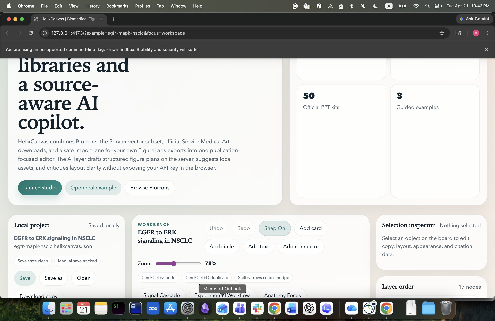

<p align="center">
  
</p>

<h1 align="center">HelixCanvas</h1>

<p align="center">
  Open-source, local-first biomedical illustration studio for publication-ready research figures.
</p>

<p align="center">
  Open libraries, provenance-first imports, optional AI planning, and export-ready composition in one workspace.
</p>

<p align="center">
  <a href="https://github.com/felizvida/helixcanvas/releases/latest"></a>
  <a href="https://github.com/felizvida/helixcanvas/actions/workflows/ci.yml"></a>
  <a href="./LICENSE"></a>
  
  
</p>

<p align="center">
  
</p>

## HelixCanvas In 30 Seconds

HelixCanvas is a local-first biomedical figure editor built for people who want publication-ready visuals without losing provenance, attribution, or control. It combines:

- a searchable open illustration library based on **Bioicons**
- curated **Servier Medical Art** assets and official kit links
- a safe import lane for **user-owned FigureLabs exports**
- a serious figure editor with layouts, exports, snapshots, and review notes
- an **optional** server-side AI copilot for planning and critique

The project is being shaped as a public-good tool rather than a commercial SaaS product. The long-term ambition is closer to an Inkscape-for-biomedical-figures than a locked-down hosted platform.

## What Ships Today

- Source-aware built-in asset packs with pack validation, license strategy, and provenance metadata
- Bioicons search plus Servier-derived vectors, Servier originals, and safe user-owned imports
- Real biology example figures and tutorial artifacts for signaling, CRISPR workflow, and retinal degeneration
- Guided Figure Flows for signaling, methods workflows, and microscopy comparisons with structured prompts and AI handoff
- Starter-template gallery for oncology, immunology, microscopy, neuroscience, infection, and neutral workflow boards
- Insertable scientific builders for membrane pathways, compartment maps, assay strips, and timecourse timelines, now with domain-aware variants and style presets
- One-click domain presets that combine guided flows, scientific scaffolds, builder variants, and figure themes
- Figure themes plus related-search suggestions for faster refinement once a project is in motion
- Export targets for manuscript, slides, and poster work plus downloadable review bundles
- Multi-select, marquee selection, grouping, alignment guides, align/distribute, reorder, lock, and hide controls
- Panel-layout presets, legend blocks, callout blocks, scale bars, and reusable components
- Local project open/save, recovery drafts, named local snapshots, snapshot compare, and figure branching
- Inline pinned review comments that stay in the project but stay out of exports
- Semantic asset retrieval plus domain starter kits for oncology, immunology, neuroscience, and microscopy workflows
- SVG, PNG, PDF, JSON, and citation-bundle export paths
- Optional AI brief-to-plan drafting, edit-by-instruction, and figure critique with the API key kept on the server
- Command palette workflow for fast local actions and AI-powered figure edits
- Installable offline-ready app shell with service-worker caching for local-first use
- Desktop packaging for macOS with a branded app icon plus native open/save dialogs

## Why It Feels Different

- **Local-first:** the core editor is useful with no account and no cloud dependency.
- **Provenance-first:** assets keep source and license context instead of becoming anonymous clip art.
- **AI-optional:** the editor works without AI, and the AI path is structured rather than magical.
- **Contributor-friendly:** packs, examples, docs, and validations are meant to be extendable in the open.

## Project Docs

- [Open-source roadmap](./docs/OSS_ROADMAP.md)
- [Personal workbench direction](./docs/PERSONAL_WORKBENCH.md)
- [GitHub milestone plan](./docs/GITHUB_MILESTONES.md)
- [Product overview](./docs/PRODUCT_OVERVIEW.md)
- [Asset pack spec](./docs/ASSET_PACK_SPEC.md)
- [Real biology tutorial](./docs/tutorial/README.md)
- [Contributing guide](./CONTRIBUTING.md)
- [Code of conduct](./CODE_OF_CONDUCT.md)

## Start Locally

1. Clone Bioicons locally:

```bash
git clone --depth 1 https://github.com/duerrsimon/bioicons /tmp/bioicons
```

2. Build the library manifest:

```bash
npm run build:library
```

If you have a local Bioicons checkout, point the script at it with `BIOICONS_DIR=/path/to/bioicons`. If not, the script will reuse the checked-in Bioicons cache and still regenerate the pack manifest.

3. Install dependencies:

```bash
npm install
```

4. Start the app plus local API:

```bash
npm run dev
```

Optional desktop build on macOS:

```bash
npm run build:desktop-icon
npm run desktop:dir
```

That produces a packaged app bundle in `dist-desktop/mac-arm64/HelixCanvas.app` with native project-file open/save dialogs.

5. Optionally configure AI:

```bash
export OPENAI_API_KEY=your_key_here
```

Use [.env.example](./.env.example) as the reference for local configuration. If you skip AI setup, the editor still works and the AI controls simply stay optional.

## Quality Checks

Run the local verification suite with:

```bash
npm run check
```

Useful supporting commands:

```bash
npm run check:packs
npm run build:library
npm run build:tutorial
```

GitHub Actions runs the same checks on pushes to `main` and on pull requests through [`.github/workflows/ci.yml`](./.github/workflows/ci.yml).

## Current Architecture

### Editor

- `src/App.jsx` — main editor experience and local-first workflow
- `src/lib/editorSelection.js` — selection, marquee, alignment, and guide helpers
- `src/lib/domainPresets.js` — one-click preset recipes that combine flows, themes, and scaffolds
- `src/data/starterTemplates.js` — curated starter-template entry points for concrete figure archetypes
- `src/lib/figureFlows.js` — guided figure-builder definitions and scene-graph generation
- `src/lib/figureThemes.js` — palette systems and current-figure restyling helpers
- `src/lib/scientificBuilders.js` — insertable scientific scaffold blocks with configurable variants and style presets
- `src/lib/exportPresets.js` — manuscript, slides, and poster export target helpers
- `src/lib/layoutPresets.js` — manuscript panel layout logic
- `src/lib/projectFiles.js` — local project file helpers and validation
- `src/lib/projectSnapshots.js` — named local checkpoints
- `src/lib/projectCompare.js` — snapshot-to-current comparison summaries
- `src/lib/reusableComponents.js` — reusable motif and component storage
- `src/lib/reviewComments.js` — pinned review notes that persist locally
- `src/lib/exporters.js` — SVG, PNG, PDF, JSON, and attribution export helpers

### Assets

- `src/lib/assets.js` — ranking, semantic retrieval, recents, favorites, and suggestion helpers
- `src/lib/assetPacks.js` — pack schema, normalization, validation, and summary helpers
- `src/data/domainStarterKits.js` — domain-tuned starting points for common biological figure workflows
- `packs/` — first-class committed asset pack files for built-ins and examples
- `public/packs/` — local assets referenced by committed pack files
- `scripts/validate-asset-pack.mjs` — pack validation CLI used locally and in CI
- `scripts/generate-bioicons-index.mjs` — Bioicons indexing pipeline
- `public/data/library.packs.json` — generated built-in asset pack manifest

### AI

- `src/lib/ai.js` — browser client for local AI endpoints
- `server/index.mjs` — local API server and production host
- `server/aiService.mjs` — OpenAI orchestration and structured output contracts

### Desktop

- `desktop/main.cjs` — Electron shell, embedded local server startup, and native file dialogs
- `desktop/preload.cjs` — safe desktop bridge for project-file open/save
- `scripts/build-desktop-icon.sh` — macOS icon generation from the shared SVG brand asset

## Roadmap Right Now

The repo has already moved beyond “blank-canvas prototype” territory. The active push now is to finish the highest-leverage parity work while keeping the open-source differentiators strong.

Current focus:

- guided figure builders that reduce blank-canvas work for common scientific figure types
- reusable scientific scaffolds for membranes, compartments, assay lanes, and timelines
- richer starter templates and more domain-specific figure presets
- domain presets and tasteful figure themes that get users to a polished first draft faster
- better export targets and review bundles for real coauthor and PI handoff
- richer scientific builders and smarter templates
- stronger export presets for paper, slide, and poster workflows
- better retrieval, starter kits, and pack discovery
- more tutorials, examples, and contributor-facing architecture docs

See [docs/OSS_ROADMAP.md](./docs/OSS_ROADMAP.md) and [docs/GITHUB_MILESTONES.md](./docs/GITHUB_MILESTONES.md) for the concrete milestone structure.

## Community

Good contribution areas right now:

- editor polish and interaction design
- asset metadata and pack structure
- export fidelity and citation workflows
- documentation and tutorials
- accessibility improvements
- optional AI provider integrations

## Sources

- [Bioicons](https://bioicons.com/)
- [Bioicons GitHub](https://github.com/duerrsimon/bioicons)
- [Servier Medical Art](https://smart.servier.com/)
- [Servier Image Kits](https://smart.servier.com/image-kits-by-category/)
- [FigureLabs](https://figurelabs.vercel.app/)

## Notes

- Bioicons licenses vary by asset and are preserved in the generated manifest.
- Servier Medical Art content requires attribution and is surfaced with compliance guidance.
- FigureLabs is treated as an import lane rather than a bundled stock corpus.
- Review comments and local snapshots stay in project workflows but do not pollute exports.
- HelixCanvas is released under the [Apache-2.0 license](./LICENSE).
