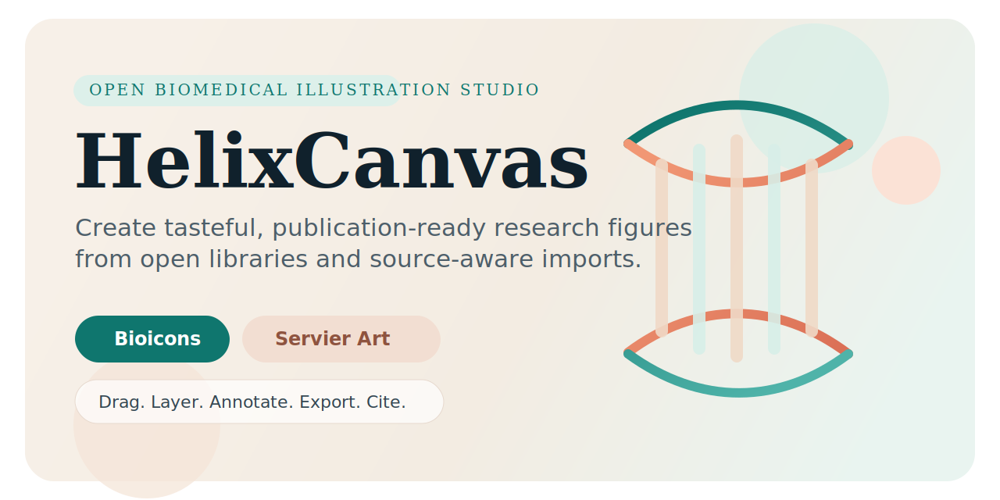

<p align="center">
  
</p>

<h1 align="center">HelixCanvas</h1>

<p align="center">
  Open-source, local-first biomedical illustration studio for publication-ready research figures.
</p>

<p align="center">
  Open libraries, provenance-first imports, optional AI planning, and export-ready composition in one workspace.
</p>

## What HelixCanvas Is

HelixCanvas is a local-first biomedical figure tool that combines:

- a searchable open illustration library based on **Bioicons**
- curated **Servier Medical Art** assets and kit links
- a safe import lane for **user-owned FigureLabs exports**
- a drag-and-drop editor for research diagrams
- an **optional** server-side AI copilot for planning and critique

The goal is simple: help researchers move from a rough scientific idea to a clean, publication-ready visual without losing track of source provenance or attribution, and without requiring a paid platform.

## Open-Source Direction

HelixCanvas is being shaped as a public-good tool:

- zero-cost by default
- local-first and useful without AI
- transparent about sources, licenses, and attribution
- open to community packs and contributor improvements
- designed to stay maintainable without a required hosted backend

The long-term ambition is closer to an Inkscape-for-biomedical-figures than a commercial SaaS editor.

## Current Capabilities

- Unified in-app library for Bioicons assets with preserved licensing metadata
- Servier-authored vector subset surfaced through Bioicons
- Official Servier Medical Art raster examples and PPTX kit links
- Drag-and-drop canvas with undo/redo, keyboard nudging, snap-to-grid, layering, resizing, and export
- Local project open/save flows with recovery drafts for destructive actions
- Asset curation features including saved assets, recent assets, and relevance-aware library sorting
- FigureLabs handled as **import-only**, avoiding redistribution of unclear third-party gallery assets
- Optional AI drafting from a research brief into a structured figure plan
- Optional AI critique for hierarchy, narrative flow, provenance risk, and caption quality
- Citation bundle export for attribution-ready outputs

## AI Design

AI is architecturally meaningful in HelixCanvas, but intentionally optional.

- The OpenAI API key stays on the **server**, not in the browser.
- `POST /api/ai/plan` converts a research brief into structured JSON for a figure plan.
- `POST /api/ai/critique` reviews the current board and returns actionable design feedback.
- The client remains deterministic: it applies plans locally, matches suggested assets against the local library, and preserves export and attribution behavior.

This keeps AI useful without making the editor opaque, costly by default, or required for baseline workflows.

## Library Strategy

### Bioicons

Bioicons is the main searchable vector library. Asset-level source and license metadata are preserved in the generated manifest.

### Servier Medical Art

Servier is surfaced in two ways:

- Servier-authored vectors already represented in Bioicons
- official Servier raster assets and downloadable PPTX kits

### FigureLabs

FigureLabs is intentionally treated as a **user-owned import lane**. HelixCanvas does not bundle public FigureLabs gallery content as a built-in stock corpus because reuse rights are not assumed to be openly redistributable.

## Project Docs

- [Open-source roadmap](./docs/OSS_ROADMAP.md)
- [Product overview](./docs/PRODUCT_OVERVIEW.md)
- [Contributing guide](./CONTRIBUTING.md)
- [Code of conduct](./CODE_OF_CONDUCT.md)

## Local Development

1. Clone Bioicons locally:

```bash
git clone --depth 1 https://github.com/duerrsimon/bioicons /tmp/bioicons
```

2. Build the local Bioicons manifest:

```bash
BIOICONS_DIR=/tmp/bioicons npm run build:library
```

3. Install dependencies:

```bash
npm install
```

4. Start the app plus local API:

```bash
npm run dev
```

5. Optionally configure AI:

```bash
export OPENAI_API_KEY=your_key_here
```

Use [.env.example](./.env.example) as the reference for local configuration. If you skip this step, the editor still works and AI features remain disabled.

## Quality Checks

Run the local verification suite with:

```bash
npm run check
```

GitHub Actions runs the same checks on pushes to `main` and on pull requests through [`.github/workflows/ci.yml`](./.github/workflows/ci.yml).

## Project Structure

- `src/App.jsx` — main editor experience
- `src/lib/ai.js` — browser client for local AI endpoints
- `src/lib/assets.js` — asset ranking, recents, favorites, and suggestion helpers
- `src/lib/projectFiles.js` — local project file helpers and validation
- `src/lib/history.js` — project history helpers
- `src/data/templates.js` — starter layouts and design presets
- `src/data/servier.js` — Servier metadata, source policy, and kit links
- `src/lib/exporters.js` — SVG, JSON, and attribution export helpers
- `server/index.mjs` — local API server and production host
- `server/aiService.mjs` — OpenAI orchestration and structured output contracts
- `scripts/generate-bioicons-index.mjs` — Bioicons indexing pipeline
- `public/data/bioicons.library.json` — generated searchable asset manifest

## Community

If you want to help, good contribution areas include:

- editor polish and interaction design
- asset metadata and pack structure
- export fidelity and citation workflows
- documentation and tutorials
- accessibility improvements
- optional AI provider integrations

## Sources

- [Bioicons](https://bioicons.com/)
- [Bioicons GitHub](https://github.com/duerrsimon/bioicons)
- [Servier Medical Art](https://smart.servier.com/)
- [Servier Image Kits](https://smart.servier.com/image-kits-by-category/)
- [FigureLabs](https://figurelabs.vercel.app/)

## Notes

- Bioicons licenses vary by asset and are preserved in the generated manifest.
- Servier Medical Art content requires attribution and is surfaced with compliance guidance.
- AI suggestions are intentionally **source-aware** and designed to support, not override, editorial control.
- HelixCanvas is being developed as an open-source public-good tool, not as a commercial SaaS product.
