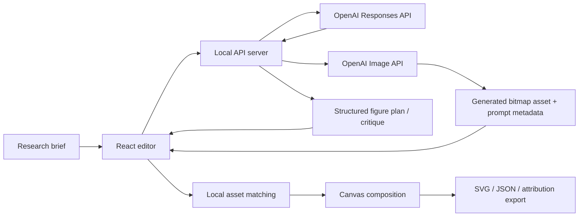

# HelixCanvas Product Overview

## Executive Summary

HelixCanvas is a local-first, open-source biomedical illustration project for researchers who need publication-ready figures built from open or user-owned assets. It combines a curated figure library, a visual composition workspace, attribution-aware exports, and an optional server-side AI copilot that helps users plan and critique figures without exposing model credentials in the browser.

The project sits in the gap between:

- general-purpose design tools that are not source-aware for scientific publishing
- biomedical asset libraries that offer raw components without an integrated composition workflow
- closed illustration platforms that may be strong on UX but weaker on transparency, provenance, or extensibility

HelixCanvas is designed to make provenance, composition, and optional AI-assisted planning feel like one system while remaining useful with zero paid infrastructure.

## Product Vision

Researchers should be able to describe a figure in the language of science and receive:

1. a sensible visual structure
2. relevant asset suggestions from trusted libraries
3. a workspace for editing, refining, and annotating the figure
4. attribution-ready output for publication or presentation

The long-term vision is a public-good figure operating system for biomedical communication: part editor, part library, part scientific art director.

The project should mature more like Blender, Inkscape, or Krita than like a hosted SaaS design product.

## Intended Users

### Primary users

- biomedical researchers
- postdocs and graduate students
- principal investigators preparing grants and manuscripts
- scientific communications teams

### Secondary users

- educators building lecture figures
- biotech teams creating mechanism-of-action visuals
- translational research groups producing posters and graphical abstracts

## Product Principles

### 1. Source-aware by default

Every asset should carry provenance and licensing context with it through the workflow.

### 2. AI should structure, not obscure

AI is used to produce explicit plans, critiques, and search prompts, not hidden logic or arbitrary auto-design.

### 3. The project must remain useful without AI

AI is optional. Users should still be able to search, compose, annotate, export, and attribute figures with no model configured.

### 4. Editorial control stays with the user

The final figure remains manually editable. AI helps accelerate direction and review; it does not lock the user into opaque generation.

### 5. Scientific taste matters

Publication-ready figures need hierarchy, restraint, clarity, and credibility. The product should feel intentional, not generic.

## Core Workflow

1. The user describes the target figure in plain language.
2. The optional AI planner proposes a structured figure architecture.
3. The client applies that plan to a local editable canvas.
4. The app suggests matching assets from Bioicons, Servier-derived vectors, Servier originals, or user imports.
5. The user edits text, layout, connectors, and scale.
6. The optional AI critique reviews the draft for clarity and compliance issues.
7. The user saves local checkpoints, reusable motifs, and review notes as the figure evolves.
8. The figure is exported as SVG, PNG, PDF, or JSON, with attribution text available for publication workflows.

## Current Feature Set

### Library and provenance

- searchable Bioicons library
- Servier-authored vector subset surfaced through Bioicons
- official Servier Medical Art raster examples
- official Servier PPTX kit links
- user-owned FigureLabs import lane

### Editor

- drag-and-drop canvas
- text nodes
- shape nodes
- connectors
- marquee multi-select
- grouping and ungrouping
- align and distribute controls
- live alignment guides
- layer order controls
- lock and hide controls
- panel layout presets
- reusable components
- callout, legend, and scale-bar blocks
- pinned review comments
- selection inspector
- undo and redo
- asset favorites and recents
- local project open/save flows
- recovery draft support for destructive actions
- named local snapshots
- SVG export
- PNG export
- PDF export
- JSON export
- citation bundle export

### AI

- brief-to-plan generation
- template recommendation
- panel sequencing
- callout drafting
- asset search query generation
- caption drafting
- critique of current board clarity and provenance posture
- optional OpenAI Image 2 content generation for user-owned figure elements, panel backdrops, and graphical-abstract components

## Why FigureLabs Is Import-Only

FigureLabs is integrated as a user-owned import mechanism rather than a bundled built-in stock library. The project does not assume that public FigureLabs gallery content is openly licensable for redistribution. This keeps HelixCanvas on firmer ground with respect to provenance and reuse while still supporting people who already own or export assets from FigureLabs.

## Architecture

### Front end

- React + Vite application
- local canvas state stored in browser local storage
- deterministic rendering and export behavior

### Server

- lightweight Express server
- serves AI endpoints and can host the production build
- reads `OPENAI_API_KEY` from the server environment

### AI layer

- uses the OpenAI Responses API for planning, critique, and structured scene edits
- uses the OpenAI Image API with `gpt-image-2` by default for optional visual content generation
- returns **structured JSON** for figure logic, not free-form prose
- supports four primary contracts:
  - figure planning
  - figure critique
  - instruction-to-scene edits
  - generated image asset creation
- is optional rather than required for baseline usage

### Asset pipeline

- generated Bioicons manifest built from a local Bioicons clone
- cached-manifest fallback so contributors can still regenerate pack outputs without a fresh Bioicons checkout
- versioned built-in pack manifest in `public/data/library.packs.json`
- first-class committed pack files under `packs/` for curated built-ins and examples
- asset metadata preserved in `public/data/bioicons.library.json`
- pack schema, validation, and flattening logic in `src/lib/assetPacks.js`
- pack validation CLI in `scripts/validate-asset-pack.mjs`
- Servier policy and kit metadata defined in source data files

## Why This Architecture Is Meaningful

The AI layer is not a thin "ask a chatbot" feature. When enabled, it influences architecture in three important ways:

### 1. Server-side key handling

The API key never enters the browser runtime.

### 2. Structured outputs

The AI returns typed figure plans and critiques that the app can render predictably. That makes AI outputs safer to operationalize inside a design tool.

### 3. Generated content provenance

OpenAI Image 2 outputs are saved as user-generated project assets with the model, prompt, size, quality, and generation timestamp preserved. They are not treated as bundled open-library assets.

### 4. Deterministic application behavior

The client, not the model, decides how to apply a plan to the canvas, how to match assets locally, and how exports are produced. This preserves trust and debuggability.

## Project Position

HelixCanvas is not trying to outdo specialized scientific illustration products solely on asset volume. Its differentiation is:

- openness and transparency around asset sourcing
- optional AI integration with structured planning and provenance-aware generated content
- publication-aware attribution workflow
- extensibility for user-owned imports and future asset packs

The project is especially compelling for people and teams that care about provenance, reproducibility, open-science alignment, or zero-cost access.

## Current Status Snapshot

HelixCanvas is already beyond the earliest proof-of-concept phase. The repo now has:

- first-class asset packs with validation and provenance summaries
- local project files, recovery drafts, and named snapshots
- editor-depth features like marquee selection, grouping, align/distribute, panel layouts, and reusable components
- review-friendly pinned comments that remain local-first and stay out of exports
- SVG, PNG, PDF, JSON, and attribution output paths
- real biology examples and tutorial artifacts for multiple figure styles

That means the current gap is no longer “can this make a figure?” The remaining work is about deeper text and connector controls, stronger retrieval, richer export presets, and smoother contributor ergonomics.

## Risks and Open Questions

### Asset licensing complexity

Even open libraries have heterogeneous licensing. The project should continue surfacing provenance clearly and avoid flattening all assets into a single implied license.

### AI overreach

The model must not fabricate scientific claims or overly confident annotations. Prompting, output schemas, and generated-image metadata should continue to bias toward structure, restraint, and human review.

### Asset fit quality

The current asset suggestion layer is keyword-based on the client. A future version could use embeddings or a hybrid retrieval strategy for better matching.

### Open-source maintainability

The project now has a first-class built-in pack format, but it still needs a contributor-facing pack authoring guide, more validation tooling, and a cleaner path for third-party community packs.

## Near-Term Roadmap

See [OSS_ROADMAP.md](./OSS_ROADMAP.md) for the active milestone plan.

Near-term priorities are:

- editor polish and local project reliability
- export and presentation presets
- asset manifest and retrieval maturity
- contributor experience and public documentation
- optional AI provider boundaries

## Repository Guide

For quick onboarding, use the README as the GitHub front door.

For product context, architecture rationale, and project direction, use this document.

Together they should make the repository understandable to:

- collaborators joining the codebase
- potential users evaluating the project
- future maintainers deciding where to extend the platform
