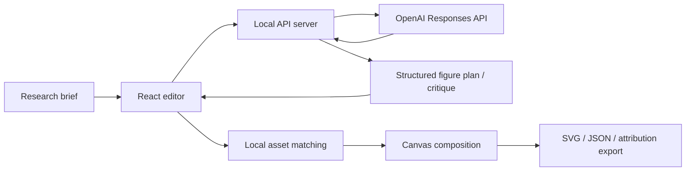

# HelixCanvas Product Overview

## Executive Summary

HelixCanvas is an AI-assisted biomedical illustration platform for researchers who need publication-ready figures built from open or user-owned assets. It combines a curated figure library, a visual composition workspace, attribution-aware exports, and a server-side AI copilot that helps users plan and critique figures without exposing model credentials in the browser.

The product sits in the gap between:

- general-purpose design tools that are not source-aware for scientific publishing
- biomedical asset libraries that offer raw components without an integrated composition workflow
- closed illustration platforms that may be strong on UX but weaker on transparency around provenance or extensibility

HelixCanvas is designed to make provenance, composition, and AI-assisted planning feel like one system.

## Product Vision

Researchers should be able to describe a figure in the language of science and receive:

1. a sensible visual structure
2. relevant asset suggestions from trusted libraries
3. a workspace for editing, refining, and annotating the figure
4. attribution-ready output for publication or presentation

The long-term vision is a figure operating system for biomedical communication: part editor, part library, part scientific art director.

## Intended Users

### Primary users

- biomedical researchers
- postdocs and graduate students
- principal investigators preparing grants and manuscripts
- scientific communications teams

### Secondary users

- educators building lecture figures
- biotech teams creating mechanism-of-action visuals
- translational research groups producing posters and graphical abstracts

## Product Principles

### 1. Source-aware by default

Every asset should carry provenance and licensing context with it through the workflow.

### 2. AI should structure, not obscure

AI is used to produce explicit plans, critiques, and search prompts, not hidden logic or arbitrary auto-design.

### 3. Editorial control stays with the user

The final figure remains manually editable. AI helps accelerate direction and review; it does not lock the user into opaque generation.

### 4. Scientific taste matters

Publication-ready figures need hierarchy, restraint, clarity, and credibility. The product should feel intentional, not generic.

## Core Workflow

1. The user describes the target figure in plain language.
2. The AI planner proposes a structured figure architecture.
3. The client applies that plan to a local editable canvas.
4. The app suggests matching assets from Bioicons, Servier-derived vectors, Servier originals, or user imports.
5. The user edits text, layout, connectors, and scale.
6. The AI critique reviews the draft for clarity and compliance issues.
7. The figure is exported as SVG or JSON, with attribution text available for publication workflows.

## Current Feature Set

### Library and provenance

- searchable Bioicons library
- Servier-authored vector subset surfaced through Bioicons
- official Servier Medical Art raster examples
- official Servier PPTX kit links
- user-owned FigureLabs import lane

### Editor

- drag-and-drop canvas
- text nodes
- shape nodes
- connectors
- layer order controls
- selection inspector
- SVG export
- JSON export
- citation bundle export

### AI

- brief-to-plan generation
- template recommendation
- panel sequencing
- callout drafting
- asset search query generation
- caption drafting
- critique of current board clarity and provenance posture

## Why FigureLabs Is Import-Only

FigureLabs is integrated as a user-owned import mechanism rather than a bundled built-in stock library. The product does not assume that public FigureLabs gallery content is openly licensable for redistribution. This keeps HelixCanvas on firmer ground with respect to provenance and reuse while still supporting teams that already own or export assets from FigureLabs.

## Architecture

### Front end

- React + Vite application
- local canvas state stored in browser local storage
- deterministic rendering and export behavior

### Server

- lightweight Express server
- serves AI endpoints and can host the production build
- reads `OPENAI_API_KEY` from the server environment

### AI layer

- uses the OpenAI Responses API
- returns **structured JSON**, not free-form prose
- supports two primary contracts:
  - figure planning
  - figure critique

### Asset pipeline

- generated Bioicons manifest built from a local Bioicons clone
- asset metadata preserved in `public/data/bioicons.library.json`
- Servier policy and kit metadata defined in source data files

## Why this architecture is meaningful

The AI layer is not a thin “ask a chatbot” feature. It influences architecture in three important ways:

### 1. Server-side key handling

The API key never enters the browser runtime. This is required for a product intended to be used seriously.

### 2. Structured outputs

The AI returns typed figure plans and critiques that the app can render predictably. That makes AI outputs safer to operationalize inside a design tool.

### 3. Deterministic application behavior

The client, not the model, decides how to apply a plan to the canvas, how to match assets locally, and how exports are produced. This preserves trust and debuggability.

## Competitive Positioning

HelixCanvas is not trying to outdo specialized scientific illustration products solely on asset volume. Its differentiation is:

- openness and transparency around asset sourcing
- server-side AI integration with structured planning
- publication-aware attribution workflow
- extensibility for user-owned imports

The product is especially compelling for teams that care about provenance, reproducibility, or open-science alignment.

## Risks and Open Questions

### Asset licensing complexity

Even open libraries have heterogeneous licensing. The product should continue surfacing provenance clearly and avoid flattening all assets into a single implied license.

### AI overreach

The model must not fabricate scientific claims or overly confident annotations. Prompting and output schemas should continue to bias toward structure and restraint.

### Asset fit quality

The current asset suggestion layer is keyword-based on the client. A future version could use embeddings or a hybrid retrieval strategy for better matching.

### Production deployment

The current implementation is a strong local/product MVP. Multi-user auth, persistence, collaboration, billing, and hosted storage remain future work.

## Near-Term Roadmap

### Product

- richer templates for graphical abstracts, pathways, and assay timelines
- multi-panel board layouts
- reusable figure themes
- better caption and legend workflows

### AI

- asset-ranking improvements
- provenance-aware generation constraints
- manuscript-to-figure planning from uploaded text
- figure style consistency checks

### Platform

- hosted persistence
- team workspaces
- version history
- shareable review links

## Repository Guide

For quick onboarding, use the README as the GitHub front door.

For product context, architecture rationale, and roadmap thinking, use this document.

Together they should make the repository understandable to:

- collaborators joining the codebase
- potential users evaluating the project
- future maintainers deciding where to extend the platform
