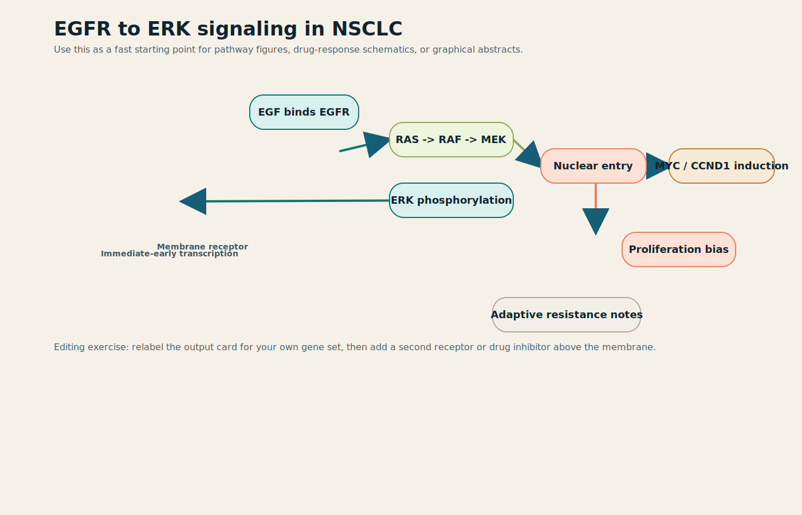
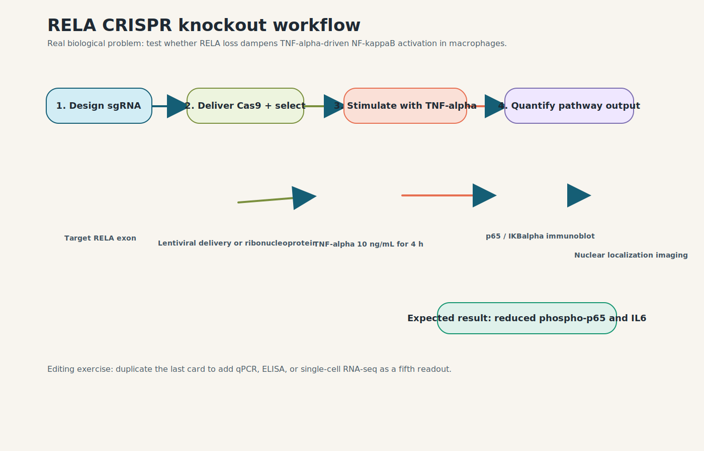
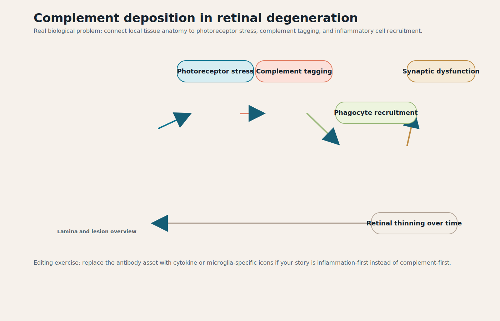

# HelixCanvas Tutorial: Real Biological Figures

This tutorial teaches HelixCanvas through real interface work and real biological figure problems. It is meant for a researcher, trainee, educator, or open-source contributor who wants to go from a blank idea to an editable, export-ready biomedical figure while preserving provenance.

The tutorial uses the same example projects that ship in the app:

- `egfr-mapk-nsclc`: receptor signaling mechanism figure
- `rela-crispr-macrophage`: CRISPR perturbation workflow figure
- `retinal-complement-degeneration`: retinal pathology and immune-tagging figure

Each example includes an editable project file, rendered SVG figure, and citation bundle. The optional AI sections use the local server and your own `OPENAI_API_KEY`; the non-AI path remains fully usable.

## Learning Path

By the end, you should be able to:

- load a real biological example into the live editor
- identify the three working areas: source library, canvas, and inspector
- edit labels, cards, assets, connector semantics, and layout
- use snapshots, review comments, and exports during a revision loop
- generate optional OpenAI Image 2 content as a provenance-tagged user asset
- export SVG, PNG, PDF, project JSON, and citation text without losing source context

Suggested pacing:

- 10 minutes: quick interface tour and one figure load
- 25 minutes: one complete walkthrough
- 45 to 60 minutes: all three examples plus export and provenance checks
- 90 minutes: teaching session with extension exercises

## Setup

Install dependencies and build the local asset manifest:

```bash
npm install
npm run build:library
```

Start the app and local API server:

```bash
npm run dev
```

Open the app:

```text
http://127.0.0.1:4173/
```

Optional AI setup:

```bash
export OPENAI_API_KEY=your_key_here
export HELIXCANVAS_OPENAI_IMAGE_MODEL=gpt-image-2
npm run dev
```

If AI is not configured, you can still use templates, Figure Flows, scientific builders, imports, editing, snapshots, and exports. AI controls will remain optional.

## Live Interface Tour

This screenshot is taken from the running application, not a mockup:


Main areas:

- Top bar: project actions, attribution copy, command palette, and exports.
- Left sidebar: project files, snapshots, export controls, starter templates, domain presets, Figure Flows, scientific builders, tutorial examples, AI copilot, and source library.
- Center canvas: editable figure board with assets, shapes, text, connectors, selection guides, review pins, and zoom controls.
- Right inspector: selected-object editing, layout helpers, review comments, layer order, and publication compliance.

Important behavior:

- Placed assets keep source, license, and citation metadata.
- Review comments stay in the project but are excluded from figure exports.
- Snapshots are local checkpoints for comparing revisions.
- Generated images are user-generated assets, not bundled open-library assets.

## Quick Start

1. Open one of the direct example URLs below.
2. Select an object on the board and look at the Selection inspector.
3. Open the Source-aware library and search for a related biological term.
4. Add one new asset or annotation card.
5. Save a snapshot before making a larger revision.
6. Export SVG or PNG and copy the citation bundle.

Direct example URLs:

```text
http://127.0.0.1:4173/?example=egfr-mapk-nsclc&focus=workspace
http://127.0.0.1:4173/?example=rela-crispr-macrophage&focus=workspace
http://127.0.0.1:4173/?example=retinal-complement-degeneration&focus=workspace
```

## Tutorial 1: EGFR to ERK Signaling in NSCLC

Biological problem:
Create a mechanistic figure for ligand-triggered EGFR activation, ERK nuclear entry, and immediate-early transcription in non-small-cell lung cancer.

Open locally:

```text
http://127.0.0.1:4173/?example=egfr-mapk-nsclc&focus=workspace
```

What this teaches:

- building a pathway schematic from membrane to nucleus
- combining Bioicons and Servier-derived vectors with editable explanatory cards
- revising a mechanistic story while keeping attribution intact
- extending a pathway into treatment-state comparison

Walkthrough:

1. Select the cell or receptor asset and inspect its source, license, and citation metadata.
2. Select the `Ligand binding`, `Signal relay`, or `Cell response` card and edit the label to match your own pathway.
3. Use the library search for `receptor kinase`, `nucleus`, or `transcription`.
4. Add a matching asset to the canvas and position it near the relevant pathway step.
5. Use `Add connector` to link the new asset to an existing step.
6. Save a snapshot named `EGFR baseline`.
7. Duplicate the receptor region and relabel it as inhibitor-treated.
8. Export SVG and copy attributions.

Optional AI path:

1. In the AI copilot panel, paste this brief:

```text
Create a receptor-to-nucleus mechanism figure for EGFR activation in non-small-cell lung cancer. Show ligand binding, MAPK pathway relay, ERK nuclear entry, immediate-early transcription, and an inhibitor-treated comparison.
```

2. Click `AI draft`, then compare the generated plan with the curated example.
3. Use `AI critique` after your manual edits to check hierarchy, caption clarity, and provenance risks.
4. Use OpenAI Image 2 content generation only for an inset or visual component, not for unsupported biological claims.

Image 2 prompt to try:

```text
A clean vector-style inset showing EGFR receptors clustered on a cancer cell membrane with a subtle MAPK relay motif, no fake data, no watermark.
```

Suggested exercise:
Replace `MYC / CCND1 induction` with your own readout, then duplicate the receptor region to compare ligand-only and inhibitor-treated conditions.

Figure artifact:



Files:

- [SVG figure](./egfr-mapk-nsclc.svg)
- [Project file](./egfr-to-erk-signaling-in-nsclc.helixcanvas.json)
- [Citations](./egfr-mapk-nsclc.citations.txt)

## Tutorial 2: RELA CRISPR Knockout Workflow

Biological problem:
Lay out an experimental workflow that tests whether `RELA` knockout suppresses `TNF-alpha` induced NF-kappaB signaling in macrophages.

Open locally:

```text
http://127.0.0.1:4173/?example=rela-crispr-macrophage&focus=workspace
```

What this teaches:

- structuring a methods figure as a left-to-right protocol
- mixing perturbation, stimulation, and orthogonal readouts on one canvas
- turning a dense wet-lab plan into an editorially clean graphic
- using snapshots and review comments during methods-figure revision

Walkthrough:

1. Select the CRISPR element and inspect its citation.
2. Rename one method step to match your own construct, guide RNA, or knockout target.
3. Insert a `1 x 3` or `2 x 2` panel layout if you want to separate model, perturbation, and readouts.
4. Add a review note asking whether the readout order matches the experiment.
5. Save a snapshot named `Workflow before third readout`.
6. Duplicate the terminal readout card and relabel it as qPCR, ELISA, or single-cell RNA-seq.
7. Use `Compare current figure to` your snapshot to review the change.
8. Export a review bundle for a PI or coauthor.

Optional AI path:

1. Paste this edit instruction into `Edit current figure`:

```text
Make the workflow read more clearly as model system, CRISPR perturbation, TNF-alpha stimulation, readout, and interpretation. Add a concise review comment if any claim needs experimental confirmation.
```

2. Click `AI edit figure`.
3. Review every applied change before exporting.
4. If the AI focuses the library, add only assets whose provenance fits your use.

Image 2 prompt to try:

```text
A publication-style macrophage perturbation workflow backdrop with CRISPR knockout, TNF-alpha stimulation, and two assay readout zones, no fake charts.
```

Suggested exercise:
Duplicate the terminal readout card and add qPCR, ELISA, or single-cell RNA-seq as an additional assay lane.

Figure artifact:



Files:

- [SVG figure](./rela-crispr-macrophage.svg)
- [Project file](./rela-crispr-knockout-workflow.helixcanvas.json)
- [Citations](./rela-crispr-macrophage.citations.txt)

## Tutorial 3: Complement Deposition in Retinal Degeneration

Biological problem:
Build a pathology figure that connects retinal anatomy, photoreceptor stress, complement tagging, and phagocyte recruitment.

Open locally:

```text
http://127.0.0.1:4173/?example=retinal-complement-degeneration&focus=workspace
```

What this teaches:

- moving from tissue overview to mechanistic pathology on the same board
- using color to separate stress, immune tagging, and downstream degeneration
- adapting a disease-overview figure for papers, lectures, or grant applications
- separating open-library assets from generated or user-imported content

Walkthrough:

1. Select the retina overview and note how the source panel records provenance.
2. Select each process card and identify the color logic for stress, complement tagging, recruitment, and degeneration.
3. Add a callout block explaining the most important caveat in your disease model.
4. Search the library for `microglia`, `cytokine`, `retina`, or `antibody`.
5. Replace or supplement the complement-tagging asset with a mechanism that fits your own story.
6. Add a scale bar only if the figure is representing microscopy-like content and the scale is meaningful.
7. Run an AI critique or manual review against three questions: Is the anatomy clear? Is the mechanism supported? Are sources/citations complete?
8. Export PNG for slides and SVG for manuscript editing.

Optional AI path:

1. Paste this brief:

```text
Create a retinal degeneration teaching figure that starts with tissue context, then shows photoreceptor stress, complement deposition, phagocyte recruitment, and progressive retinal thinning.
```

2. Use `AI draft` for a candidate structure, but keep the curated example as the reference.
3. Use Image 2 for a visual inset only if you need a modern microscopy-like backdrop.

Image 2 prompt to try:

```text
A microscopy-inspired retinal degeneration panel with photoreceptor stress and complement deposition cues, dark-field fluorescent style, no fake scale bar.
```

Suggested exercise:
Swap the complement-tagging icon for a cytokine or microglia-specific element and relabel the lower card to track thinning across timepoints or treatment arms.

Figure artifact:



Files:

- [SVG figure](./retinal-complement-degeneration.svg)
- [Project file](./complement-deposition-in-retinal-degeneration.helixcanvas.json)
- [Citations](./retinal-complement-degeneration.citations.txt)

## Optional Lab: Generate Content With OpenAI Image 2

Use this lab when you want a custom visual component that is not available in Bioicons, Servier Medical Art, or your own FigureLabs exports.

Rules for generated content:

- Treat generated images as user-generated project assets.
- Keep prompt, model, size, quality, and generation timestamp with the asset.
- Do not use generated images as evidence for a biological claim.
- Avoid fake data, fake labels, fake microscopy scale bars, watermarks, logos, and publication-style text that cannot be verified.
- Prefer generated assets for backgrounds, insets, visual metaphors, or draft composition ideas.

Workflow:

1. Configure `OPENAI_API_KEY` and restart `npm run dev`.
2. Open an example project.
3. Find the `AI copilot` panel.
4. In `OpenAI Image 2 content`, write a prompt for a figure element.
5. Choose style, size, quality, and format.
6. Click `Generate and place`.
7. Select the generated asset and inspect its source box.
8. Save a snapshot before integrating it deeply into the figure.
9. Export the citation bundle and confirm that generated-content provenance is present.

Recommended settings:

- Use `Medium` quality for normal tutorial work.
- Use `Low draft` for quick exploration.
- Use `High` only when you are close to final visual direction.
- Use `PNG` for figure assets unless you need smaller `JPEG` or `WebP` files.
- Use square or landscape sizes for components that will sit inside an existing figure board.

## Provenance And Export Checklist

Before sharing or publishing a figure:

- Select every imported or generated asset and confirm its source label.
- Copy attributions and check that citation text is not empty.
- Confirm that FigureLabs imports are user-owned and publication rights are understood.
- Confirm that OpenAI Image 2 outputs are reviewed for scientific accuracy.
- Use snapshots before large edits so you can compare versions.
- Export SVG for downstream vector editing.
- Export PNG for slides and quick sharing.
- Export PDF when a flattened page artifact is useful.
- Export the project JSON if another HelixCanvas user should continue editing.

## Regenerating Tutorial Artifacts

When example projects change, regenerate the tutorial assets:

```bash
npm run build:tutorial
```

This updates:

- `*.svg` rendered figures
- `*.helixcanvas.json` project files
- `*.citations.txt` attribution bundles
- `tutorial.manifest.json` with direct URLs, learning goals, exercises, and Image 2 prompt suggestions

If you update the live interface screenshot, run the app, load the EGFR example, and capture a new `docs/tutorial/egfr-interface.png` from the real browser session.

## Troubleshooting

- If the app opens but the library is empty, run `npm run build:library`.
- If AI controls say offline, confirm `OPENAI_API_KEY` is set in the same shell that runs `npm run dev`.
- If Image 2 generation fails, check that your OpenAI organization can use GPT Image models and that the prompt is not empty.
- If imported or generated assets do not persist, export the project JSON and keep a copy of important source files.
- If a figure looks crowded, save a snapshot, apply a panel layout, then compare against the previous version.

## Teaching Notes

For a classroom, journal club, or lab onboarding session:

- Assign each learner one tutorial figure and one biological modification.
- Require one source-library asset, one text edit, one review comment, and one exported citation bundle.
- Ask learners to explain which elements are open-library, imported, or generated.
- Compare two snapshots to discuss visual hierarchy and scientific clarity.
- End with a short critique: what claim does the figure support, and what claim would need more data?

## Why These Examples Matter

These examples cover three common figure jobs:

- signaling mechanism figures for papers and graphical abstracts
- experimental workflows for methods sections, protocols, and lab meetings
- disease-overview pathology figures for teaching, grants, and reviews

The goal is that a trainee, educator, or researcher can start from a biologically meaningful figure immediately instead of from a blank canvas.
